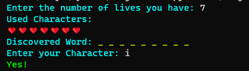
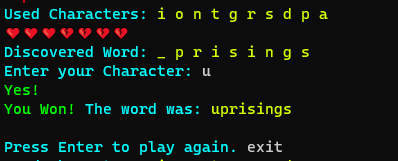
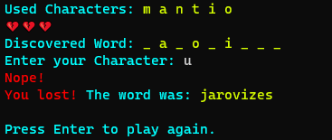
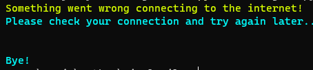

# HangMan
## Info
HangMan Game is a classic word game where the goal is to guess the hidden word or phrase by choosing letters. The game is usually played with a pen and paper, where one player thinks of a word and draws a row of dashes to indicate the number of letters. The other player then tries to guess the word by suggesting letters. If the letter is in the word, the first player writes it in the correct position. If the letter is not in the word, the first player draws one part of a hangman figure on a gallows. The second player has to guess the word before the hangman figure is complete. - Bing AI 

Body part count of hangman depends on your host. 
- The most common one is <code>[Head, Body, Left Arm, Right Arm, Left Leg and Right Lef]</code> i.e. 6 wrong guesses and the game is over.
- <code>[Head, Pair of Eyes, Nose, Sad Mouth, Body, Pair of Arms, Pair of legs]</code> i.e. 7 wrong guesses and the game is over.
- <code>[Entire hangman is hung, The rope breaks off dropping hangman in hot boiling oil] i.e. 2 wrong rules and the game is over.</code> 

Yeah the rule can be ridiculous by the host. But the rule is you have limited life and if hangman dies, Game over.

## In this Game
Because it is a console application, and i have limited skills for now, there is no hangman in hangman Game. Yeah Shocking. Instead, there is emojee of heart and broken heart. If there is one unbroken heart, one wrong move is forgiving i.e. you have 2 chances. For <code>[Head, Body, Left Arm, Right Arm, Left Leg and Right Lef]</code> i.e. 6 wrong guesses to kill the game, you have to choose 5 life when you are asked. But it cannot be more than 10 beacuse there would be no point of playing hangman if all 26 character guesses cannot kill hangman.

## Operational Mannual
Computer asks for life. <code>Enter the number of lives you have: </code> Here you will enter how many wrong moves are forgiving before game over. If you enter 3, three hearts will show off and 4 wrong moves will kill the game. number of broken heart means you have used up that number of chances. 
Discovered word will have _ _ _ like "fill in the blanks" thing. Each blank line will be filled if you enter correct letter. Used character will show all the character used prevoiulsy no mater if that was right or wrong. Previously used character cannot be used again.  
After you enter your character, computer will tell you either <code>Yes!</code> or <code>Nope!</code> indicating if the character you have entered is right or wrong. if you have entered all correct character, The game detects it and says <code>You Won!</code>. Else, game tells you <code>You lost!</code>. 
The game will run infinitly on loop. But if you want to quite, just press <code>Ctrl + C</code> or type in <code>exit</code> anywhere game is asking for your input. 
## Known Bugs
- If I know it, I will try to fix it. That is the entire point of over complicating things. To push my boundry. So, please report! There can be errors. But program should not crash.
## Screenshots

## Thanks To
Special thanks to random word [API](https://random-word-api.herokuapp.com/word) hosted by [RazorSh4rk](https://github.com/RazorSh4rk) on [Github](https://github.com/RazorSh4rk/random-word-api)

# Happy Hanging...
