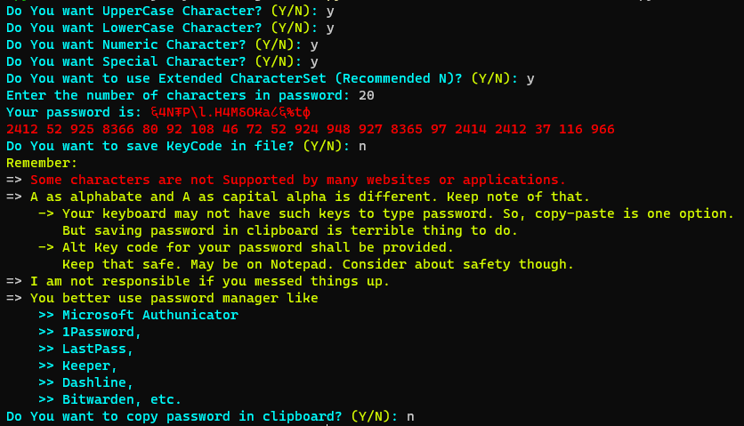

# Password Generator
## Intro
Password is a key we use to authenticate ourself.
## In this program
You can create password. You can choose if you want to have Upper case, Lower Case, Numeric Character or external character. You can also choose to use extended set of characters to give extra trouble to one trying to bruteforce your password. But that extra set comes with consequences. ease of use and wide suport is out of equation in extended set.
## Operational Mannual
first, you enter y or n in asked question to respond yes or no. Extended character set contains Greek alphabet, Nepali alphabet and numbers, and other symbols or alphabet and space. This is not reommended to use. Then you are asked to enter number of characters in password. This can be 4 characters to 64 characters long. 
Then password id generated and displayed to you. 
Program also provide the keycode of each character of password. Suppose if <code>A</code> is the first character of password, the first number that displays in password is <code>65</code>. In python, <code>chr(65)</code> returns <code>A</code>. This system is implemented because <code>A</code> and <code>Α</code> looks same but it is not. First <code>A</code> is capital letter of english alphabet <code>a</code> and second <code>Α</code> is capital letter of greek alphabet <code>α</code>. If you lost lour password by such confusion, the keycodes can be used to recover your password [Not implemented yet.].
 
You may want to save the keycode in file. If you press y, it will save where terminal is opened. We call it "working directory". 
Program also gives you option to copy password in keyboard.

## Requirement
- pyperclip - <code>pip install pyperclip</code>

## Screenshot

As we can see, <code>६4Ν₮P\l.H4ΜδΟ₭a८६%tφ</code> is the generated password.