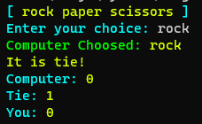
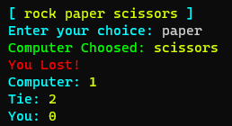
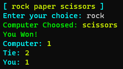
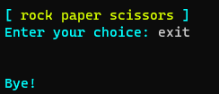

# Rock Paper Scissors
## Info
Rock paper scissors is a simple and fun game that you can play with your friends. It is based on the idea that rock beats scissors, scissors beats paper, and paper beats rock.
## Operational Mannual
You have to enter your choice first. The choices are given in screen and spelling matters. If there is wrong input like any thing out of option or typo, game will not accept it. After you have entered your valid choice, game will show what has it choosen and tells you if you lost, won or tied against computer. Game will also display counter for how many time computer has won, how many times has the game ended in tie, and how many times have you (player) won. 
The game will loop for infinity. So if you want to break out of game, press <code>Ctrl + C</code> or type in <code>exit</code> wherever computer asks for keyboard input.
## Known Bugs
- If I know it, I will try to fix it. That is the entire point of over complicating things. To push my boundry. So, please report!
## Screenshots
It is Tie 
 
Computer Won 
 
You Won 
 
Exit 
 